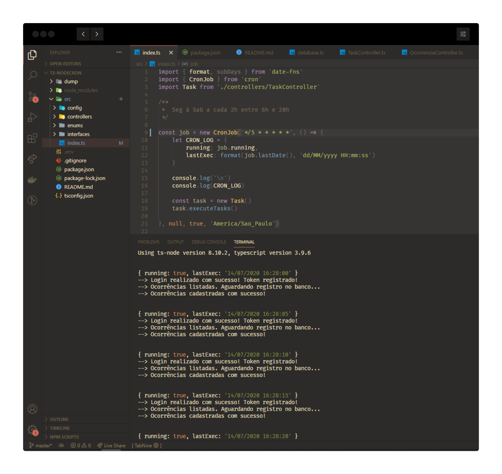
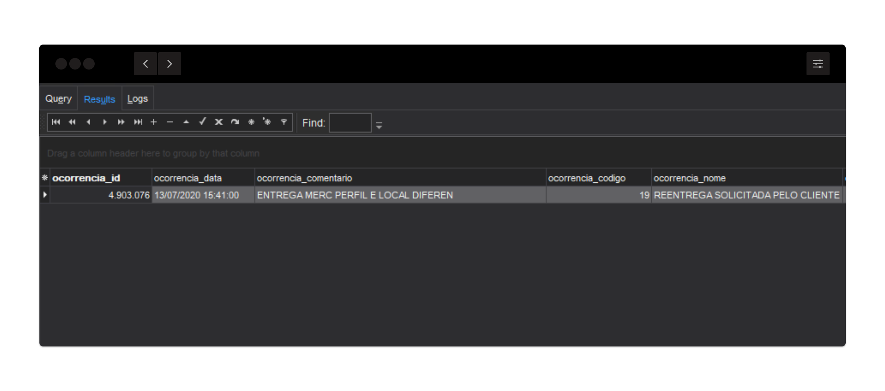

## :watch: Node + Typescript Cron Job

### Agendamento de tasks 
> 1. O robô loga na API e retorna o Token.
> 2. Consome todos os dados dentro do período.
> 3. Grava a resposta no banco de dados.

### Execução
> Executa de Segunda à Sábado a cada 2h entre 6h e 20h.

### Registro
> Busca ocorrências num período de 7 dias.

